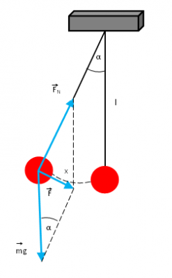

# Project Pendulum

A mathematical pendulum is a material point suspended on a weightless and inextensible thread, deflected from its equilibrium position by an angle alpha. We can treat this pendulum as a heavy and small ball suspended on a rope.

The figure shows the forces acting on a mathematical pendulum deflected from its equilibrium position by an angle \alpha.
The resultant force F, forcing harmonic motion, is equal to:

F = -mgsin *-alpha .

For small angles (less than 7°), sin alpha = alpha , so we can write that:  
 F = -mg \alpha .

According to the second law of dynamics, force is the product of mass and acceleration -F=ma. Comparing the last two equations we get:

ma = -mg*alpha              
a = -g * alpha

# Gif's

  
  
  
  

## You can download here:

https://github.com/dominikoka/application_pendulum

Enjoy using Day Quote!
